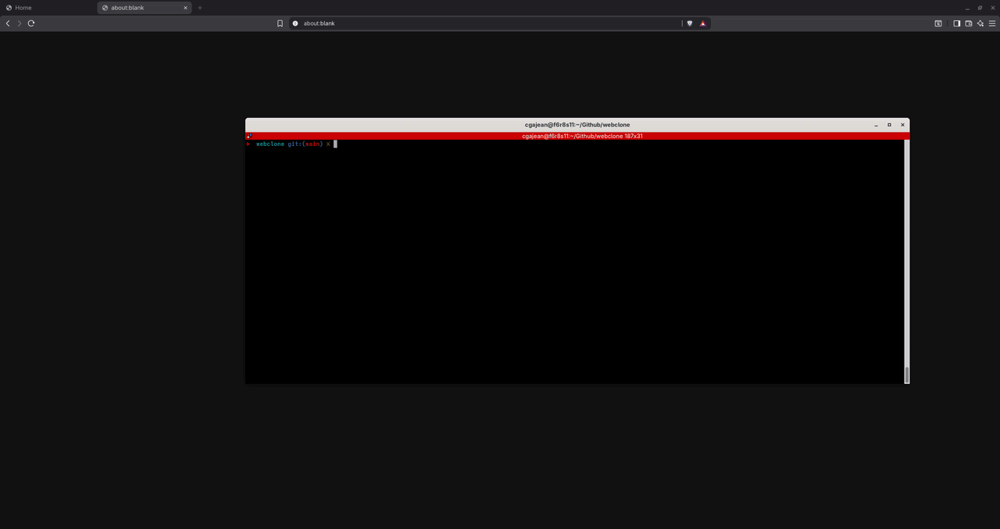

# webserv

> An HTTP/1.1 server written from scratch in C++98 — no external libraries, just sockets, file descriptors, and the spec.



---

## Description

**webserv** is a small HTTP/1.1 server inspired by NGINX. It parses a configuration file built around nested `http`, `server`, and `location` blocks, routes incoming requests to the correct virtual server, validates them against the selected configuration, and executes the appropriate response logic.

**Key features:**
- Configuration file parsing inspired by NGINX
- Multiple virtual servers with `Host`-based, port-based, and URI-based routing
- IPv4 and IPv6 listening sockets
- Static file serving and directory autoindex
- File uploads
- CGI support — Python, Perl, Bash
- Basic session handling with cookies
- Methods: GET, POST, PUT, DELETE

---

## Architecture - Reactor pattern

The server is built around an event-driven, non-blocking architecture.

1. **Config parsing** — the `.conf` file is tokenized, then parsed into `http`, `server`, and `location` block structures used to instantiate the virtual servers.
2. **NetworkManager** — opens every configured port in IPv4 and IPv6 and starts listening for connections.
3. **Router** — once a request is parsed, selects the correct virtual server based on `Host`, port, and URI.
4. **Execution context** — built from the client request and the matched server configuration.
5. **HandlerValidator** — checks whether the request is executable: allowed method, file existence and accessibility, CGI target validity.
6. **Handler dispatch** — the correct handler is selected and executed, filling a `resource_context_t` structure with the file descriptors needed to read, write, upload, or send the resource.

---

## Build & Run

```bash
# Build
make

# Run
./webserv ./config.conf
```

---

## Test

```bash
# Virtual host routing
curl --resolve example.com:8080:127.0.0.1 http://example.com:8080
curl --resolve exemplaire.com:8080:127.0.0.1 http://exemplaire.com:8080
curl --resolve autre.com:8080:127.0.0.1 http://autre.com:8080

# GET
curl http://localhost:8080/
curl -I http://localhost:8080/

# POST — method not allowed on /
curl -v -X POST -H "Content-Type: text/plain" --data "body" http://localhost:8080/

# POST — allowed on /downloads/
curl -v -X POST -H "Content-Type: text/plain" --data "body" http://localhost:8080/downloads/

# PUT
curl -X PUT --data-binary @README.md http://localhost:8080/downloads/file.txt

# DELETE
curl -X DELETE http://localhost:8080/downloads/file.txt
```

---

## Configuration

The configuration system is inspired by NGINX, simplified. Supports:

- `http` block for global settings
- One or more `server` blocks for virtual servers
- Nested `location` blocks for route-specific rules

Configurable per block: listening port, `server_name`, allowed methods via `limit_except`, `autoindex`, CGI settings, custom error pages, client body size limits.

---

## Project Structure

```
include/
├── handlers/       # static files, CGI, autoindex, errors, validation
├── http/           # request, response, parsing, serialization, HTTP utilities
├── network/        # connections, routing, sessions, acceptors, event management
├── vserver/        # virtual server creation and configuration
└── tools/          # parsing and utility helpers
```

---

## References

- [RFC 9110](https://www.rfc-editor.org/rfc/rfc9110) — HTTP Semantics
- [RFC 9112](https://www.rfc-editor.org/rfc/rfc9112) — HTTP/1.1
- [RFC 3875](https://www.rfc-editor.org/rfc/rfc3875) — CGI/1.1
- NGINX documentation
- POSIX socket and network programming manual pages
- UNIX Netword Programming vol.1, 3rd edition - Stevens, Fenner, Rudoff

---

*Built at 42 Paris by Christophe Gajean and Carlos De Jesus Figueira.*
